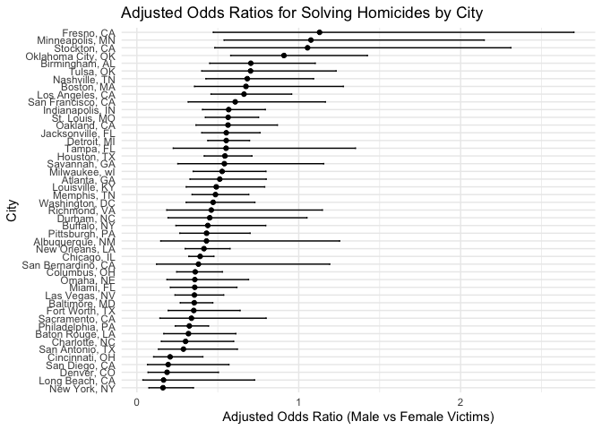
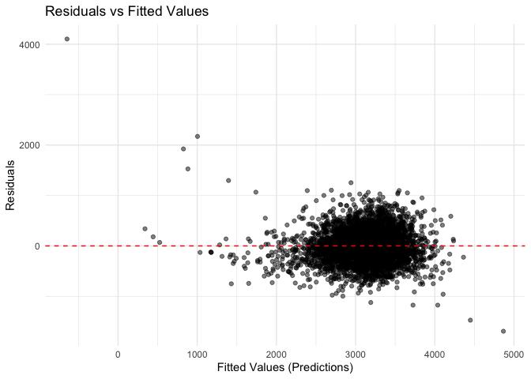
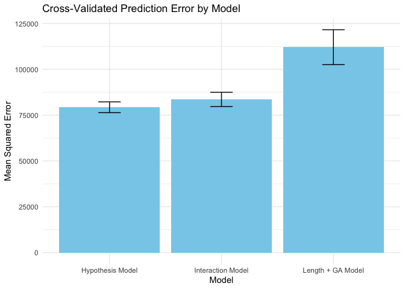

hw6
================
Shike Zhang
2024-12-02

``` r
library(tidyverse)
```

    ## ── Attaching core tidyverse packages ──────────────────────── tidyverse 2.0.0 ──
    ## ✔ dplyr     1.1.4     ✔ readr     2.1.5
    ## ✔ forcats   1.0.0     ✔ stringr   1.5.1
    ## ✔ ggplot2   3.5.1     ✔ tibble    3.2.1
    ## ✔ lubridate 1.9.3     ✔ tidyr     1.3.1
    ## ✔ purrr     1.0.2     
    ## ── Conflicts ────────────────────────────────────────── tidyverse_conflicts() ──
    ## ✖ dplyr::filter() masks stats::filter()
    ## ✖ dplyr::lag()    masks stats::lag()
    ## ℹ Use the conflicted package (<http://conflicted.r-lib.org/>) to force all conflicts to become errors

``` r
library(broom)
library(purrr)
library(modelr)
```

    ## 
    ## Attaching package: 'modelr'
    ## 
    ## The following object is masked from 'package:broom':
    ## 
    ##     bootstrap

``` r
library(crossval)
library(scales)
```

    ## 
    ## Attaching package: 'scales'
    ## 
    ## The following object is masked from 'package:purrr':
    ## 
    ##     discard
    ## 
    ## The following object is masked from 'package:readr':
    ## 
    ##     col_factor

``` r
library(rnoaa)
```

    ## The rnoaa package will soon be retired and archived because the underlying APIs have changed dramatically. The package currently works but does not pull the most recent data in all cases. A noaaWeather package is planned as a replacement but the functions will not be interchangeable.

``` r
library(rsample)
```

## Problem 1

``` r
# Step 1: Pull weather data from rnoaa
weather_df <- rnoaa::meteo_pull_monitors(
  c("USW00094728"), 
  var = c("PRCP", "TMIN", "TMAX"), 
  date_min = "2017-01-01", 
  date_max = "2017-12-31"
) %>%
  mutate(
    name = recode(id, USW00094728 = "CentralPark_NY"),
    tmin = tmin / 10,  # Convert temperatures to Celsius
    tmax = tmax / 10
  ) %>%
  select(name, id, everything())
```

    ## using cached file: /Users/shikez/Library/Caches/org.R-project.R/R/rnoaa/noaa_ghcnd/USW00094728.dly

    ## date created (size, mb): 2024-12-02 19:02:08.794274 (8.667)

    ## file min/max dates: 1869-01-01 / 2024-11-30

``` r
# Preview the data
head(weather_df)
```

    ## # A tibble: 6 × 6
    ##   name           id          date        prcp  tmax  tmin
    ##   <chr>          <chr>       <date>     <dbl> <dbl> <dbl>
    ## 1 CentralPark_NY USW00094728 2017-01-01     0   8.9   4.4
    ## 2 CentralPark_NY USW00094728 2017-01-02    53   5     2.8
    ## 3 CentralPark_NY USW00094728 2017-01-03   147   6.1   3.9
    ## 4 CentralPark_NY USW00094728 2017-01-04     0  11.1   1.1
    ## 5 CentralPark_NY USW00094728 2017-01-05     0   1.1  -2.7
    ## 6 CentralPark_NY USW00094728 2017-01-06    13   0.6  -3.8

``` r
# Step 2: Fit the linear regression model
lm_model <- lm(tmax ~ tmin, data = weather_df)

# Summary of the model
summary(lm_model)
```

    ## 
    ## Call:
    ## lm(formula = tmax ~ tmin, data = weather_df)
    ## 
    ## Residuals:
    ##     Min      1Q  Median      3Q     Max 
    ## -6.0304 -2.1245  0.0264  1.7264  9.4915 
    ## 
    ## Coefficients:
    ##             Estimate Std. Error t value Pr(>|t|)    
    ## (Intercept)  7.20850    0.22635   31.85   <2e-16 ***
    ## tmin         1.03924    0.01699   61.16   <2e-16 ***
    ## ---
    ## Signif. codes:  0 '***' 0.001 '**' 0.01 '*' 0.05 '.' 0.1 ' ' 1
    ## 
    ## Residual standard error: 2.938 on 363 degrees of freedom
    ## Multiple R-squared:  0.9115, Adjusted R-squared:  0.9113 
    ## F-statistic:  3741 on 1 and 363 DF,  p-value: < 2.2e-16

``` r
# Extract R-squared using broom::glance()
r_squared <- glance(lm_model)$r.squared
r_squared  # Display R^2 value
```

    ## [1] 0.9115425

``` r
# Define the bootstrap function
set.seed(123)
bootstrap_samples <- bootstraps(weather_df, times = 5000)

# Perform bootstrap analysis
bootstrap_results <- bootstrap_samples %>%
  mutate(
    # Fit linear models on each bootstrap sample
    models = map(splits, ~lm(tmax ~ tmin, data = analysis(.))),
    
    # Extract R-squared values for each model
    r_squared = map_dbl(models, ~glance(.x)$r.squared),
    
    # Extract coefficients and calculate log(beta0 * beta1)
    log_beta = map(models, ~tidy(.x)) %>%
      map_dbl(~ {
        beta0 <- .x %>% filter(term == "(Intercept)") %>% pull(estimate)
        beta1 <- .x %>% filter(term == "tmin") %>% pull(estimate)
        log(beta0 * beta1)
      })
  )

# Extract bootstrap results
r_squared_bootstrap <- bootstrap_results$r_squared
log_beta_bootstrap <- bootstrap_results$log_beta

# Calculate 95% Confidence Intervals
r_squared_ci <- quantile(r_squared_bootstrap, c(0.025, 0.975))
log_beta_ci <- quantile(log_beta_bootstrap, c(0.025, 0.975))

# Display the confidence intervals
cat("R-Squared 95% Confidence Interval:\n")
```

    ## R-Squared 95% Confidence Interval:

``` r
print(r_squared_ci)
```

    ##      2.5%     97.5% 
    ## 0.8945701 0.9271042

``` r
cat("\nLog(Beta0 * Beta1) 95% Confidence Interval:\n")
```

    ## 
    ## Log(Beta0 * Beta1) 95% Confidence Interval:

``` r
print(log_beta_ci)
```

    ##     2.5%    97.5% 
    ## 1.964166 2.058364

## Problem 2

``` r
homicide_data <- read_csv("homicide-data.csv")
```

    ## Rows: 52179 Columns: 12
    ## ── Column specification ────────────────────────────────────────────────────────
    ## Delimiter: ","
    ## chr (9): uid, victim_last, victim_first, victim_race, victim_age, victim_sex...
    ## dbl (3): reported_date, lat, lon
    ## 
    ## ℹ Use `spec()` to retrieve the full column specification for this data.
    ## ℹ Specify the column types or set `show_col_types = FALSE` to quiet this message.

``` r
# Create city_state variable
homicide_data <- homicide_data %>%
  mutate(city_state = paste(city, state, sep = ", "))

# Create binary variable for solved cases
homicide_data <- homicide_data %>%
  mutate(solved = ifelse(grepl("Closed", disposition), 1, 0))

# Omit specified cities and filter by race
filtered_data <- homicide_data %>%
  filter(!city_state %in% c("Dallas, TX", "Phoenix, AZ", "Kansas City, MO", "Tulsa, AL"),
         victim_race %in% c("White", "Black")) %>%
  mutate(victim_age = as.numeric(victim_age)) %>%
  filter(!is.na(victim_age))
```

    ## Warning: There was 1 warning in `mutate()`.
    ## ℹ In argument: `victim_age = as.numeric(victim_age)`.
    ## Caused by warning:
    ## ! NAs introduced by coercion

``` r
# Logistic regression for Baltimore, MD
baltimore_data <- filtered_data %>% filter(city_state == "Baltimore, MD")
baltimore_glm <- glm(solved ~ victim_age + victim_sex + victim_race, 
                     data = baltimore_data, family = binomial)

# Extract adjusted odds ratio and confidence intervals for male vs female victims
baltimore_results <- broom::tidy(baltimore_glm) %>%
  filter(term == "victim_sexMale") %>%
  mutate(adjusted_OR = exp(estimate),
         CI_lower = exp(estimate - 1.96 * std.error),
         CI_upper = exp(estimate + 1.96 * std.error))

print(baltimore_results)
```

    ## # A tibble: 1 × 8
    ##   term       estimate std.error statistic  p.value adjusted_OR CI_lower CI_upper
    ##   <chr>         <dbl>     <dbl>     <dbl>    <dbl>       <dbl>    <dbl>    <dbl>
    ## 1 victim_se…    -1.04     0.143     -7.26 3.74e-13       0.355    0.268    0.469

``` r
# Loop over all cities
city_results <- filtered_data %>%
  group_by(city_state) %>%
  nest() %>%
  mutate(glm_model = map(data, ~ glm(solved ~ victim_age + victim_sex + victim_race, 
                                     data = ., family = binomial)),
         tidy_results = map(glm_model, broom::tidy)) %>%
  unnest(tidy_results) %>%
  filter(term == "victim_sexMale") %>%
  mutate(adjusted_OR = exp(estimate),
         CI_lower = exp(estimate - 1.96 * std.error),
         CI_upper = exp(estimate + 1.96 * std.error))
```

``` r
# Plot the results
city_results %>%
  arrange(adjusted_OR) %>%
  ggplot(aes(x = reorder(city_state, adjusted_OR), y = adjusted_OR)) +
  geom_point() +
  geom_errorbar(aes(ymin = CI_lower, ymax = CI_upper), width = 0.2) +
  coord_flip() +
  labs(title = "Adjusted Odds Ratios for Solving Homicides by City",
       x = "City",
       y = "Adjusted Odds Ratio (Male vs Female Victims)") +
  theme_minimal()
```

<!-- --> This plot shows
the adjusted odds ratios (ORs) for solving homicides comparing male
victims to female victims across different cities, along with their
confidence intervals (CIs).

Some cities, like Fresno, CA, and Minneapolis, MN, have much higher odds
of solving cases involving male victims compared to female victims, as
indicated by ORs significantly greater than 1. Other cities, like New
York, NY, and Long Beach, CA, have ORs closer to or below 1, indicating
less difference or even lower odds for male victims compared to female
victims. Confidence Intervals:

Wide confidence intervals for some cities (e.g., Atlanta, GA) suggest
uncertainty in the estimates, likely due to smaller sample sizes or less
consistent case characteristics. Narrower intervals (e.g., Washington,
DC) indicate more precise estimates. Rank Order:

The cities are ordered by their estimated ORs, helping to visualize
where male victim cases are more likely to be resolved relative to
female victim cases.

## Problem 3

``` r
birthweight <- read.csv("birthweight.csv",stringsAsFactors = FALSE)
```

``` r
#Data Cleaning
birthweight <- birthweight %>%
  mutate(
    babysex = factor(babysex, levels = c(1, 2), labels = c("Male", "Female")),
    frace = factor(frace),
    mrace = factor(mrace),
    malform = factor(malform)
  )

# Check for missing data
missing_data <- sapply(birthweight, function(x) sum(is.na(x)))
print(missing_data)
```

    ##  babysex    bhead  blength      bwt    delwt  fincome    frace  gaweeks 
    ##        0        0        0        0        0        0        0        0 
    ##  malform menarche  mheight   momage    mrace   parity  pnumlbw  pnumsga 
    ##        0        0        0        0        0        0        0        0 
    ##    ppbmi     ppwt   smoken   wtgain 
    ##        0        0        0        0

``` r
# Hypothesis-driven model for birthweight
model_proposed <- lm(bwt ~ blength + gaweeks + babysex + malform + parity + smoken + ppbmi, 
                     data = birthweight)

#Residuals vs Fitted Values Plot
birthweight <- birthweight %>%
  add_predictions(model_proposed, var = "predictions") %>%
  add_residuals(model_proposed, var = "residuals")

ggplot(birthweight, aes(x = predictions, y = residuals)) +
  geom_point(alpha = 0.5) +
  geom_hline(yintercept = 0, linetype = "dashed", color = "red") +
  labs(title = "Residuals vs Fitted Values",
       x = "Fitted Values (Predictions)",
       y = "Residuals") +
  theme_minimal()
```

<!-- -->

``` r
# Compare Models
#Define a function to compute prediction error for each model
compute_error <- function(model_formula, train_data, test_data) {
  # Fit the model on training data
  model <- lm(model_formula, data = train_data)
  
  # Predict on test data
  predictions <- predict(model, newdata = test_data)
  
  # Compute mean squared error (MSE)
  mse <- mean((test_data$bwt - predictions)^2, na.rm = TRUE)
  return(mse)
}

# Perform Monte Carlo Cross-Validation
set.seed(123)  # Ensure reproducibility
n_splits <- 10  # Number of splits

# Create Monte Carlo splits
cv_splits <- crossv_mc(birthweight, n = n_splits)

# Compute prediction errors for each model
cv_results <- cv_splits %>%
  mutate(
    # Hypothesis model
    error_hypothesis = map2_dbl(train, test, ~ compute_error(
      bwt ~ babysex + bhead + blength + delwt + gaweeks + ppbmi + smoken,
      as.data.frame(.x), as.data.frame(.y))),
    
    # Main effects model
    error_length_ga = map2_dbl(train, test, ~ compute_error(
      bwt ~ blength + gaweeks,
      as.data.frame(.x), as.data.frame(.y))),
    
    # Interaction model
    error_interactions = map2_dbl(train, test, ~ compute_error(
      bwt ~ bhead * blength * babysex,
      as.data.frame(.x), as.data.frame(.y)))
  )

# Step 3: Summarize the cross-validated prediction errors
cv_summary <- cv_results %>%
  summarize(
    hypothesis_error = mean(error_hypothesis, na.rm = TRUE),
    length_ga_error = mean(error_length_ga, na.rm = TRUE),
    interactions_error = mean(error_interactions, na.rm = TRUE),
    sd_hypothesis_error = sd(error_hypothesis, na.rm = TRUE),
    sd_length_ga_error = sd(error_length_ga, na.rm = TRUE),
    sd_interactions_error = sd(error_interactions, na.rm = TRUE)
  )

# Step 4: Create a summary table for visualization
cv_summary_table <- tibble(
  Model = c("Hypothesis Model", "Length + GA Model", "Interaction Model"),
  Mean_CV_Error = c(
    cv_summary$hypothesis_error,
    cv_summary$length_ga_error,
    cv_summary$interactions_error
  ),
  Std_Dev_Error = c(
    cv_summary$sd_hypothesis_error,
    cv_summary$sd_length_ga_error,
    cv_summary$sd_interactions_error
  )
)

print(cv_summary_table)
```

    ## # A tibble: 3 × 3
    ##   Model             Mean_CV_Error Std_Dev_Error
    ##   <chr>                     <dbl>         <dbl>
    ## 1 Hypothesis Model         79299.         2931.
    ## 2 Length + GA Model       112076.         9520.
    ## 3 Interaction Model        83574.         3890.

``` r
# Step 5: Visualize the cross-validation results
ggplot(cv_summary_table, aes(x = Model, y = Mean_CV_Error)) +
  geom_bar(stat = "identity", fill = "skyblue") +
  geom_errorbar(aes(ymin = Mean_CV_Error - Std_Dev_Error, ymax = Mean_CV_Error + Std_Dev_Error), width = 0.2) +
  labs(title = "Cross-Validated Prediction Error by Model",
       x = "Model",
       y = "Mean Squared Error") +
  theme_minimal()
```

<!-- --> The table and
plot summarize the cross-validated prediction errors for three model
Hypothesis Model: Includes predictors based on your hypothesis, such as
baby sex, head circumference, birth length, delivery weight, gestational
age, maternal BMI, and smoking.

Length + GA Model: Simplified model using only birth length and
gestational age.

Interaction Model: Includes head circumference, birth length, baby sex,
and all their interactions.

The Hypothesis Model has the lowest mean cross-validation error
(~79,299), indicating it performs better than the other models. The
Interaction Model performs slightly worse (~83,573), possibly due to
overfitting caused by complex interactions. The Length + GA Model has
the highest error (~112,076), likely due to its simplicity and omission
of key predictors.

The Hypothesis Model has the lowest standard deviation (~2,931),
suggesting consistent performance across splits. The Interaction Model
has a slightly higher standard deviation (~3,890), indicating more
variability. The Length + GA Model has the highest variability (~9,520),
possibly due to inadequate modeling of birthweight. Visualization:

The bar chart with error bars provides a clear comparison of mean
squared errors and their variability. The Hypothesis Model consistently
outperforms the others.
